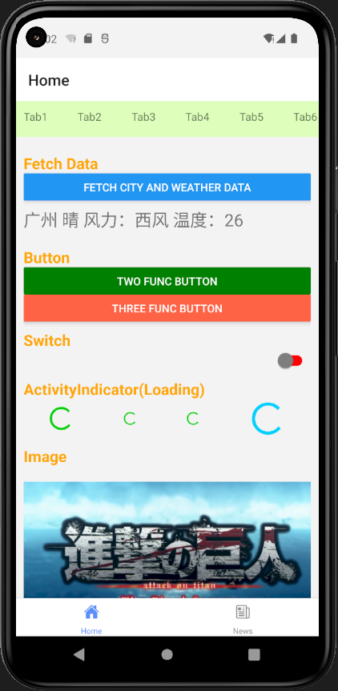
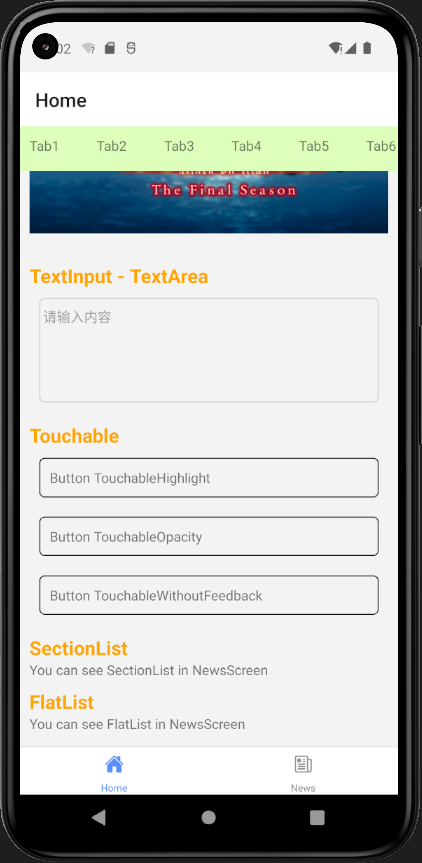
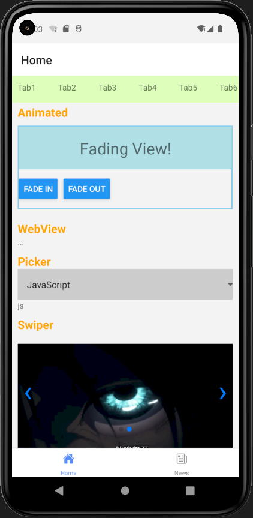
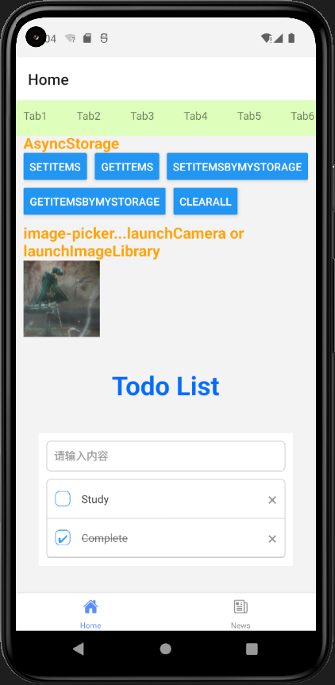

# ReactNativeDemo

This branch is used to study React Native.

## Install

**Note**: Make sure the React Native development environment has been set up.

In the command terminal, run the following commands.

    $ git clone https://github.com/gyt95/ReactNativeDemo.git
    $ cd ReactNativeDemo
    $ checkout study
    $ yarn android

## VSCode Plugins

ES7 React/Redux/GraphQL/React-Native snippets

And then use shortcut `rnc` (react native class) to create the template of class component.

And then use shortcut `rnf` (react native function) to create the template of function component.

## How to Debug

Click the device screen.

Choose ctrl + m

Click "Debug" option in the list from dialog.

Then you can use browser to debug the effect in the device. 

**If device show homepage not your app, you can restart the app by `yarn android`** 

## ScrollView

use <ScrollView> to wrap the area you want to scroll, not <View> which can't scroll.

## Flexbox

It's different to web. In web's Flexbox the mainaxis is horizontal, but the mainaxis is vertical in RN's Flexbox.

The cross axis is different too.

commonProperty:

flexDirection: column(default in RN)  row(default in web) column-reverse row-reverse
justifyContent: align in main axis (vertical)

  flex-start    |abc          |
  center        |     abc     |
  flex-end      |          abc|
  space-round   | a    b    c |
  space-evenly  |   a  b  c   |
  space-between |a     b     c|

alignItems: align in cross axis (horizontal)

flex
  flexRow 1:1:1
  a(1)  b(1)  c(1)

  flexRow 1:2:3
  a(1)b(2)b(2)c(3)c(3)c(3) // become 6 part  
  
  flexColumn 1:1:1
  a(1)  
  b(1)  
  c(1)

## Dimensions

To get width and height about device.

```js
import { Dimensions } from 'react-native';
const windowWidth = Dimensions.get('window').width;
```

There are various screen sizes, and there is no need to customize development for a certain size, so responsive layout is useful.

### Why not I use width: 100?

Because different device with different width. So you can use Dimensions instead it.

`width: Dimensions.get('window').width/4`

It means each item accounts for 1/4.

## Core Components

Components in react-native, like <View> <Image> <Text>

### Common

```
View
Text
Alert
Button
Switch
StatusBar
ActivityIndicator // show loading 

Image
TextInput
Touchable   // with three touch component
ScrollView
SectionList  // grouped List Components
FlatList    // high Performance List Components
Animated
```

## Third Party Components

## Screenshots









